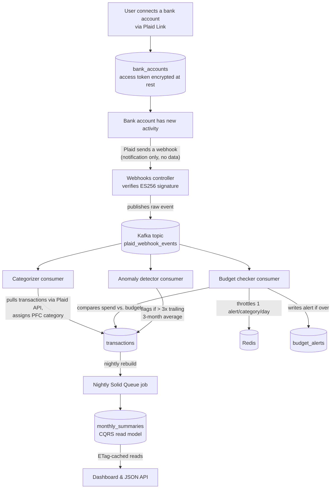
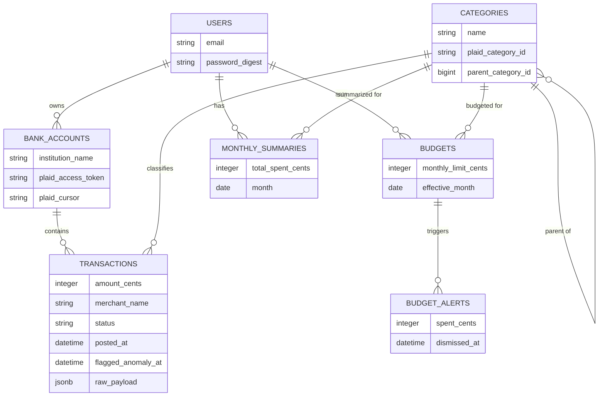

# Finance Tracker

A Ruby on Rails personal finance app that connects a bank account via Plaid, categorizes
transactions, tracks budgets, and shows a dashboard — built as a demo of a production-shaped,
event-driven backend architecture rather than a polished consumer product.

*"Connect bank accounts, categorize transactions, set budgets, get alerts."*

## Why this app exists

Finance is a harder domain to demo visually than, say, a maps or photos app. The point of this
project isn't UI polish — it's showing a realistic, production-shaped backend: a webhook
receiver, an event bus, independent consumers, a CQRS read model, and HTTP caching, all wired
together and actually working end to end against real (Sandbox) data.

Every architectural choice below is deliberate and documented, and the dashboard itself
explains its own mechanics in plain language via "How this works" notes on each page.

## How data flows in



1. A user connects a bank account through **Plaid Link** (OAuth-style flow). The app exchanges
   Link's public token for a permanent access token, encrypted at rest.
2. When that account has new activity, **Plaid sends a webhook** — a notification that new
   data is ready, not the transaction data itself.
3. The app verifies the webhook's signature (a real ES256 JWT check, not a stub) and publishes
   the raw event onto a **Kafka** topic (`plaid_webhook_events`).
4. Three independent **Karafka consumers**, each its own consumer group, read that same topic:
   - **categorizer** — pulls the actual transactions via Plaid's `/transactions/sync` API
     (cursor-based, so re-syncing only fetches what changed) and assigns each one a category
     from Plaid's real ~120-code Personal Finance Category taxonomy, with a small set of
     merchant-name overrides for the low-confidence generic buckets Plaid itself falls back to.
   - **budget checker** — compares the month's spend in a category against the user's budget
     and files an alert if it's over, throttled through Redis (`SET NX EX`) to one alert per
     category per day.
   - **anomaly detector** — flags a transaction as unusual when it's more than 3x the trailing
     3-month average for its category, and only once enough history exists to make that
     average meaningful.
5. A **nightly Solid Queue job** rebuilds a denormalized `monthly_summaries` table (a CQRS read
   model) from raw transactions. The dashboard only ever reads from that table — it never
   recomputes spend-by-category live.
6. The dashboard's summary endpoint returns an `ETag`; a client sending `If-None-Match` gets a
   `304 Not Modified` when nothing has changed since the last rebuild.

### Why Kafka, not RabbitMQ

The webhook itself carries no data — it's just a "something changed" ping. That means replaying
it is always safe: if a consumer crashes for an hour, it just resumes from its last committed
offset and re-pulls from Plaid once it's back, instead of losing anything. RabbitMQ discards a
message once it's been consumed, so that recovery story doesn't work with it — Kafka's log
persistence is what makes the "independent consumers, each replayable on its own" architecture
possible at all.

### Why Redis

`SET NX EX` gives an atomic "have I already alerted for this key today" check, with no race
condition between concurrent transaction-processing jobs. It's used only for that one
throttle key — not for queuing (see Background jobs below).

### Why a CQRS read model

Monthly spend-by-category is expensive to recompute from raw transactions on every dashboard
load. A nightly job denormalizes it into `monthly_summaries` once, so the dashboard's reads are
simple, fast lookups instead of live aggregation.

## Budgets: user-set vs. trailing-average

A user can set an explicit monthly budget for any category. If they do, that budget is what
everything compares against — the dashboard's KPI tiles, the "Budget vs. actual" chart, and the
budget-checker consumer's alerts.

For a category with spend but no user-set budget, the app falls back to a suggested amount
based on that category's trailing 3-month average spend (labeled "(avg)" wherever it appears),
so real spending is never silently excluded just because no budget was ever set for it. The
Budgets page also lists these as concrete suggestions the user can accept with one click.

## Tech stack

| Concern | Choice | Why |
|---|---|---|
| Ruby / Rails | 3.4, Rails 8.1 (full-stack with views, not API-only) | Server-rendered views + Tailwind, with a parallel versioned JSON API (`/api/v1`) alongside them |
| Database | PostgreSQL | `jsonb` for raw Plaid payloads |
| Background jobs | Solid Queue (DB-backed, runs in-process via Puma) | Nightly summary rebuild; no separate worker process or Sidekiq needed |
| Event streaming | Apache Kafka (KRaft mode, no ZooKeeper) via the `karafka` gem | See "Why Kafka" above |
| Cache / throttling | Redis (`redis-rb`) | Alert-throttle key only |
| Bank data | Official `plaid` gem, Sandbox environment | Real OAuth flow, fake bank, no real credentials |
| Auth | JWT (short-lived access token + refresh token rotation) | Used by the `/api/v1` JSON endpoints |
| API docs | `rswag` (OpenAPI generated from request specs) | Live at `/api-docs` |
| Testing | RSpec (request/model/service/consumer specs against a real Postgres, no DB mocking) + Capybara/Cuprite for E2E | Integration tests hit the real thing, not mocks; E2E drives real Chrome with no npm/Node in the loop |
| Frontend | Turbo + Stimulus + Tailwind CSS v4, no SPA framework | Hand-rolled inline SVG charts on the dashboard, no charting library |
| Logging | `lograge` — one structured JSON line per request, with a `request_id` for correlation | Enabled in every environment (no deployment yet to gate it to), see `config/initializers/lograge.rb` |

### Local dev runs natively, not in Docker

Postgres, Redis, and Kafka all run as native processes via `asdf`, with `bin/redis` and
`bin/kafka` helper scripts for the latter two. This is a deliberate deviation from the
originally planned Docker Compose + Redpanda setup — Docker isn't
available in this dev environment, and Redpanda has no reliable non-container install path.
Kafka's wire protocol is unchanged either way, so this only affects local dev; a real deployment
can use a managed Kafka service (e.g. AWS MSK) without any client code changes.

## Data model



```
users             — email/password auth
bank_accounts     — one per connected Plaid item; plaid_access_token encrypted at rest
categories        — Plaid's real PFC taxonomy, self-referential (parent_category_id)
transactions      — plaid_transaction_id unique; category_id nullable until categorized;
                    raw_payload (jsonb) keeps Plaid's full response; flagged_anomaly_at
budgets           — one per (user, category, effective_month)
budget_alerts     — one per over-budget event; dismissible
monthly_summaries — the CQRS read model; (user, category, month) unique; rebuilt nightly only
```

## Getting started

### Prerequisites

- `asdf` with the `ruby`, `nodejs`, `postgres`, `redis`, `java`, `kafka`, and `k6` plugins
  installed. Ruby is pinned in `.ruby-version`, and Java/Kafka/k6 are pinned in this repo's
  `.tool-versions`; Postgres, Redis, and Node aren't version-pinned here, so install whatever
  versions your own `asdf` setup already uses for those.
- A free [Plaid Sandbox](https://dashboard.plaid.com) account (`client_id` + `secret`, no real
  bank needed)

### Setup

```bash
asdf install                     # picks up every pinned tool version
bundle install
bin/rails db:setup

# Store Plaid Sandbox credentials in encrypted Rails credentials:
EDITOR="nano" bin/rails credentials:edit
# add:
#   plaid:
#     client_id: <your sandbox client id>
#     secret: <your sandbox secret>
#     env: sandbox
```

### Running it

Four things need to be running at once, each in its own terminal:

```bash
pg_ctl start -D <path-to-your-postgres-data-dir>  # or however your asdf postgres is normally started
bin/redis                 # alert-throttle key
bin/kafka                 # single-node broker, KRaft mode (formats storage on first run)
bin/dev                   # Rails server + Tailwind watcher (Procfile.dev)
bundle exec karafka server  # the three transaction consumers
```

Solid Queue runs in-process inside Puma — there's no separate job-worker process to start.

Then visit `http://localhost:3000`, register a user, and connect a bank account via **Bank
accounts → Connect a bank** (Plaid Link, Sandbox credentials — any of Plaid's test institutions
and test logins work).

To trigger the event pipeline without waiting for real bank activity, use Plaid's Sandbox API to
fire a simulated transaction webhook on demand — no public URL or tunnel needed for local dev.

### Testing

```bash
bundle exec rspec        # full suite — request specs hit a real Postgres, no mocking
bundle exec rubocop      # style
bin/brakeman              # static security scan
```

OpenAPI docs generated from the request specs are served at `/api-docs` once the app is
running.

### End-to-end tests

```bash
bundle exec rspec spec/e2e   # runs against real Chrome/Chromium
```

`spec/e2e` drives a real browser through the server-rendered pages — login, the Stimulus-driven
category filter, budget create/edit/delete, transaction browsing, bank account listing, logout.
It uses **Capybara + [Cuprite](https://github.com/rubycdp/cuprite)**, which talks to Chrome
directly over the Chrome DevTools Protocol, instead of Playwright, Cypress, or Selenium.
Playwright and Cypress both still shell out to an npm/Node-based driver under the hood even from
their Ruby/Rails wrapper gems — there's no way to use either without an `npm install`. Selenium
would avoid npm too, but adds a WebDriver process Cuprite doesn't need. Cuprite needs Chrome or
Chromium on `PATH` (or `BROWSER_PATH` set) and nothing else — no extra language runtime.

These specs use RSpec's own `type: :feature` (via `capybara/rspec`), not Rails' `type: :system`.
The two aren't interchangeable in every environment: `type: :system` pulls in
`ActionDispatch::SystemTesting::TestHelpers::SetupAndTeardown`, which reliably broke Cuprite's
Chrome subprocess in this project's dev sandbox even though the identical driver/options worked
everywhere else tried (standalone script, full Rails boot, a live Capybara/Puma server thread).
Plain `type: :feature` sidesteps that module and needs no `driven_by` call — the driver is set
once in `spec/support/capybara.rb`.

A real browser has its own cookie jar, separate from the RSpec process, so specs log in by
actually driving the login form (`log_in_as` in `spec/support/e2e_helpers.rb`), never a
request-spec-style `post`. That helper also asserts on the post-login page before returning,
because Turbo intercepts the login form submit and swaps the DOM via `fetch()` — there's no real
browser navigation event for Cuprite to wait on, so a bare `visit` right after the click can race
the in-flight redirect.

CI runs `spec/e2e` as its own `e2e` job, separate from the main `rspec` job, so a flaky browser
run never blocks the rest of the suite (see `.github/workflows/ci.yml`).

### Load testing

```bash
bin/dev                           # in one terminal - the app needs to be running
bin/loadtest                      # in another - seeds data, then runs k6
```

`loadtest/monthly_summary.js` (a [k6](https://k6.io) script) load-tests
`GET /api/v1/dashboard/monthly_summary` — the ETag/CQRS read path described above. Each
iteration hits it twice: once with no `If-None-Match` (a real render), then again with the ETag
the first response returned. That second call should get back a `304` — the read model hasn't
changed, so there's nothing to re-render or re-send.

The enforced thresholds are correctness-based (cache-hit rate, error rate), not latency-based —
on this small a demo dataset, the server-side cost of a `304` vs. a full render is a few
milliseconds at most, easily lost in whatever thread count Puma happens to be running with on a
given machine. The concrete, environment-independent signal is response *size*: a `304` has an
empty body, so bytes transferred is tracked as the real before/after instead of a latency target
that would be flaky on someone else's laptop.

`bin/loadtest` runs `loadtest/seed.rb` first, which gives a dedicated `loadtest@example.com` user
some categorized, posted transactions and rebuilds `monthly_summaries` from them — otherwise the
dashboard for a fresh user has nothing in it to cache. That rebuild step (`NightlySummaryRebuildJob`,
the same job the real nightly cron would run) recomputes `monthly_summaries` for *every* user, not
just the load-test one, so only run it against a local/dev database, never anything shared.

`loadtest/login.js` load-tests `POST /api/v1/auth/login` on its own (`k6 run loadtest/login.js`,
no `bin/loadtest` wrapper or seed step needed — it registers its own fixed test account in
`setup()`, which is idempotent). Unlike the dashboard script, this isn't testing a cache: it's a
genuine capacity question, since `has_secure_password` runs a real bcrypt comparison on every
login, and that cost is deliberate (that's the whole point of bcrypt), so it directly caps how
many logins/sec the app can sustain. Thresholds here are error-rate only, not latency — bcrypt's
wall-clock cost depends on the CPU it runs on, so a fixed millisecond target would be flaky on a
different machine; watch `http_req_duration` in the output to see latency move as concurrency
ramps up instead. On this project's dev machine, login averaged ~840ms per request at just 10
concurrent users — versus ~150ms for the dashboard endpoint at the same concurrency — entirely
because of the bcrypt hash, not anything else the login endpoint does.

```bash
bin/dev                           # in one terminal
bin/loadtest-transactions         # in another - seeds LOADTEST_USER_COUNT users, then runs k6
```

`loadtest/transactions.js` load-tests `GET /api/v1/transactions` under `LOADTEST_USER_COUNT`
(default 20) *distinct*, concurrently authenticated users, each fetching their own transaction
list at the same time. The point isn't just "no 500s under load" — every check asserts what came
back actually belongs to that request's own user (matching `bank_account_id` and transaction
count), proving per-user data isolation holds while many requests are in flight, not merely that
the server stayed up.

`loadtest/seed_transaction_users.rb` creates the users, their bank accounts, and a few
transactions each, and mints each one's JWT directly via `JsonWebToken.encode` — skipping the
HTTP login round trip (and its bcrypt cost, see above) entirely, since this test is about the
transactions read path, not login; mixing the two would conflate which endpoint a slow response
was actually coming from. Tokens are written to `tmp/loadtest_transaction_users.json` (gitignored,
regenerated on every run) for the k6 script to load.

20 concurrent users, not 2000: seeding and JWT generation for this test happen in-process and are
fast regardless of count, but the point of a number like this is to be something you can actually
reason about and re-run quickly while iterating. A number like 2000 tells you more about how many
Puma threads and DB connections a given deployment has than about this app's own correctness —
that's a deployment-sizing question, not something the load test itself needs to answer. Bump
`LOADTEST_USER_COUNT` if you want to see where a given local setup actually starts failing.

## Project structure

```
app/
  controllers/api/v1/   # thin JSON API controllers (envelope + status codes only)
  controllers/          # server-rendered page controllers (dashboard, budgets, etc.)
  services/             # PlaidService, TransactionSyncService, DashboardData, ...
  consumers/            # Karafka consumers: categorizer, budget_checker, anomaly_detector
  jobs/                 # Solid Queue: NightlySummaryRebuildJob
  views/                # server-rendered pages, each with its own "How this works" note
spec/
  requests/             # rswag-annotated request specs (drives /api-docs)
  services/, consumers/, models/, jobs/
config/
  karafka.rb            # consumer group / topic routing
  kafka/server.properties
```

## What's demo-scope, on purpose

This is a portfolio project, not a production fintech product. Deliberately out of scope:
notification delivery beyond an in-app alert row, multi-currency support, an admin panel, and
ML-based anomaly detection (the current rule — 3x the trailing 3-month average — is simple and
explainable by design).
